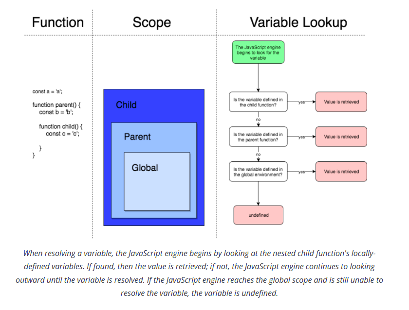
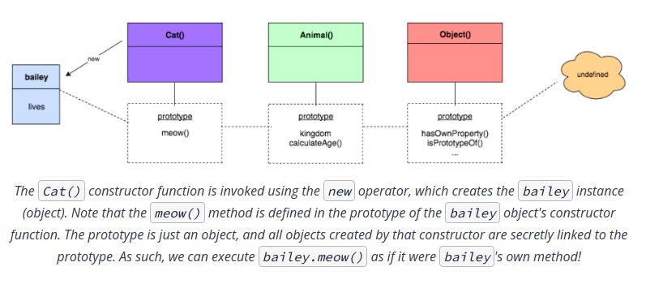

- [OOP](#oop)
  - [Introduction](#introduction)
    - [Ways to write object](#ways-to-write-object)
    - [Accessing Properties](#accessing-properties)
  - [Create and Modify Properties](#create-and-modify-properties)
    - [Creating Objects](#creating-objects)
    - [Update Properties](#update-properties)
    - [Adding Properties](#adding-properties)
    - [Removing Properties](#removing-properties)
    - [Passing Arguments](#passing-arguments)
      - [Primitives](#primitives)
      - [Objects](#objects)
  - [Invoking Object Methods](#invoking-object-methods)
    - [A Method Can Access the Object it was Called On](#a-method-can-access-the-object-it-was-called-on)
  - [Beware of Globals](#beware-of-globals)
    - [Method vs Function](#method-vs-function)
    - [window object](#window-object)
    - [Why not globals](#why-not-globals)
    - [Object constructor function methods](#object-constructor-function-methods)
  - [Functions at Runtime](#functions-at-runtime)
    - [Functions are First-Class Functions](#functions-are-first-class-functions)
    - [Methods which take callbacks](#methods-which-take-callbacks)
      - [forEach](#foreach)
      - [map](#map)
      - [filter](#filter)
    - [Scope](#scope)
      - [JS is function scoped](#js-is-function-scoped)
      - [Variable Shadowing](#variable-shadowing)
    - [Closure](#closure)
      - [Garage Collection](#garage-collection)
    - [Function](#function)
      - [Declaration](#declaration)
      - [Expression](#expression)
      - [IIFE](#iife)
  - [Classes and Objects](#classes-and-objects)
    - [Constructor Functions](#constructor-functions)
      - [Constructor Functions: Structure and Syntax](#constructor-functions-structure-and-syntax)
      - [Constructor Functions Can Have Parameters](#constructor-functions-can-have-parameters)
      - [Omitting the `new` Operator](#omitting-the-new-operator)
      - [instanceof and prototype chain](#instanceof-and-prototype-chain)
    - [`this`](#this)
      - [When is this Assigned?**](#when-is-this-assigned)
      - [What Does this Get Set To?](#what-does-this-get-set-to)
    - [Setting our own `this`](#setting-our-own-this)
      - [More Ways to Invoke Functions](#more-ways-to-invoke-functions)
        - [`call()`](#call)
        - [`apply()`](#apply)
        - [`call()` vs `apply()`](#call-vs-apply)
      - [Saving this with an Anonymous Closure](#saving-this-with-an-anonymous-closure)
        - [Saving `this` with an Anonymous Closure](#saving-this-with-an-anonymous-closure-1)
        - [Saving `this` with `bind`](#saving-this-with-bind)
    - [Prototypical Inheritance](#prototypical-inheritance)
      - [Adding methods to the Prototype](#adding-methods-to-the-prototype)
        - [Finding Properties and Methods on the Prototype Chain](#finding-properties-and-methods-on-the-prototype-chain)
      - [Replacing the `prototype` Object](#replacing-the-prototype-object)
      - [Checking an Object's Properties](#checking-an-objects-properties)
        - [hasOwnProperty()](#hasownproperty)
        - [isPrototypeOf()](#isprototypeof)
        - [Object.getPrototypeOf()](#objectgetprototypeof)
        - [The `constructor` Property](#the-constructor-property)
    - [Prototypical Inheritance Subclass](#prototypical-inheritance-subclass)
      - [Inheritance via Prototype](#inheritance-via-prototype)
      - [The Secret Link](#the-secret-link)
        - [What About Just Inheriting the Prototype?](#what-about-just-inheriting-the-prototype)
        - [Object.create()](#objectcreate)
  - [OOP Summary](#oop-summary)
  - [MISC](#misc)
- [Remember](#remember)
- [LEFT](#left)

## OOP

### Introduction

In JavaScript, an **object** is an **unordered collection of properties**. Each property consists of a **key/value pair**, and can reference either a primitive (e.g., strings, numbers, booleans, etc.) or another object.

#### Ways to write object
The following three objects are equivalent:

```js
const course = { courseId: 711 };  
const course = { 'courseId': 711 };
const course = { "courseId": 711 }; 
```

> In Python `dict` you use quotation marks notation

You'll commonly find quotation marks omitted from property names. Certain situations require them to be included, especially if the property name:
- is a **reserved word** (e.g., `for`, `if`, `let`, `true`, etc.).
- Contains **spaces or special characters** that cannot appear in a variable name

#### Accessing Properties
There are two ways: 
- dot notation 
- square bracket notation

```js
var user = {
    id: 1,
    name: {
        first: "Jess",
        last: "Adams"
    },
    18:true,
    walk: function(){
        console.log("Walking...")
    }
}
```

Possible ways to check if user is 18 or not (all of them return `true`):

```js
user[18]
user['18']
user[`18`]
user["18"]

const age = 18
user[age]
user[`${age}`]
```

### Create and Modify Properties

#### Creating Objects
The following two expressions are equivalent:
- `literal` notation (fast)
- `Object` constructor (slow and verbose)


```js
// Using literal notation:
const myObject = {};

// Using the Object() constructor function:
const myObject = new Object();
```

#### Update Properties
Simply dot notation or bracket notation.

#### Adding Properties

```js
const user = {}
user[18] = true
user.walk = function(steps)
{
    console.log(`Walking ${steps} steps.`)    
}
```

#### Removing Properties

```js
// delete '18' property
delete user[18]
user[18] // undefined
```

#### Passing Arguments


##### Primitives
>  Primitive (e.g., a string, number, boolean, etc.) is immutable and passed by value

**Global variable won't change**
```js
var id = 18;
const increment_id = (id) => {
  // age in this scope is different than that of global scope 
  id += 1;
};

increment_id(id);
console.log(id); // 18
```

```js
var id = 18;
const increment_id = () => {
    var id;
    id += 1;
};

increment_id(id);
console.log(id); // 18
```

**Global variable changes**
```js
var id = 18;
const increment_id = () => {
    id += 1;
};

increment_id(id);
console.log(id); // 19
```

##### Objects

> Objects are mutable and passed by reference

```js
var user = {
  id: 1,
  name: {
    first: "Jess",
    last: "Adams",
  },
  18: true,
  walk: function () {
    console.log("Walking...");
  },
};

const increment_id = (obj) => {
  obj.id += 1;
};
increment_id(user);
console.log(user.id); // 2

```

**Assigning Object**

```js
const new_user = user;
increment_id(new_user);
console.log(user.id); // 2
```

> Since objects are passed by reference, making changes to the copy has a direct effect on the original object.

**Comparing Objects**

```js
const ob_1 = {id:1}
const ob_2 = {id:1}
console.log(ob_1===ob_2) // false

const ob_3 = ob_2
console.log(ob_2===ob_3) // true

```

### Invoking Object Methods

#### A Method Can Access the Object it was Called On

```js
var user = {
  id: 1,
  name: {
    first: "Jess",
    last: "Adams",
  },
  18: true,
  walk: function () {
    console.log(`${this.name.first} Walking...`);
  },
};

user.walk();
// Jess Walking...

```

### Beware of Globals

#### Method vs Function

A function is a piece of code that is called by name. It can be passed data to operate on (i.e. the parameters) and can optionally return data (the return value). All data that is passed to a function is explicitly passed.

A method is a piece of code that is called by a name that is associated with an object. In most respects it is identical to a function except for two key differences:

- A method is implicitly passed the object on which it was called.
- A method is able to operate on data that is contained within the class (remembering that an object is an instance of a class - the class is the definition, the object is an instance of that data).

#### window object
`window` object has access to a ton of information about the page itself. Since the `window` object is at the highest (i.e., global) level, an interesting thing happens with **global variable declarations**. Every variable declaration that is made at the global level (outside of a function) automatically becomes a property on the `window` object!

> any global function declarations are accessible on the window object as methods

> Only declaring variables with the `var` keyword will add them to the `window` object. If you declare a variable outside of a function with either `let` or `const`, it will not be added as a property to the `window` object.

#### Why not globals

global variables and functions are not ideal. There are actually a number of reasons why, but the two we'll look at are:

- Tight coupling
  - In tight coupling, pieces of code are joined together in a way where changing one unintentionally alters the functioning of some other code
- Name collisions
  - A name collision occurs when two (or more) functions depend on a variable with the same name. A major problem with this is that both functions will try to update the variable and or set the variable, but these changes are overridden by each other!

```js

// Correct one
{
  const foo = () => {
    for (let i = 5; i > 0; i--) {
      bar(i);
    }
  };

  const bar = (digit) => {
    for (let i = 0; i < 5; i++) {
      console.log(digit);
    }
  };

  foo();
}

// Name collision happens
{
  const foo = () => {
    for (i = 5; i > 0; i--) {
      bar(i);
    }
  };

  const bar = (digit) => {
    for (i = 0; i < 5; i++) {
      console.log(digit);
    }
  };

  foo();
}

```

#### Object constructor function methods

The Object() constructor function has access to several methods to aid in development. To extract property names and values from an object, we can use:

- `Object.keys()` returns an array of a given object's own keys (property names).
- `Object.values()` returns an array of a given object's own values (property values).

### Functions at Runtime

#### Functions are First-Class Functions
In JavaScript, functions are first-class functions. This means that you can do with a function just about anything that you can do with other elements, such as numbers, strings, objects, arrays, etc. JavaScript functions can:

- Be stored in variables
- Be returned from a function.
- Be passed as arguments into another function.

> Note that while we can, say, treat a function as an object, a key difference between a function and an object is that functions can be called (i.e., invoked with ()), while regular objects cannot.


#### Methods which take callbacks

##### forEach
Array's `forEach()` method takes in a callback function and invokes that function for each element in the array. In other words, `forEach()` allows you to iterate (i.e., loop) through an array, similar to using a `for` loop.


```js
array.forEach(function callback(currentValue, index, array) {
    // function code here
});
```

##### map
Array's `map()` method is similar to `forEach()` in that it invokes a callback function for each element in an array. However, `map()` returns a new array based on what's returned from the callback function.

##### filter

Array's `filter()` method is similar to the `map()` method:

- It is called on an array
- It takes a function as an argument
- It returns a new array
The difference is that the function passed to `filter()` is used as a test, and only items in the array that pass the test are included in the new array.

#### Scope

```js
// global variable
const a = "a";

function parent() {
  // variable from parent scope
  const b = "b";

  function child() {
    // variable from child scope
    const c = "c";
  }
}

```

> The nested `child()` function has access to all `a`, `b`, and `c` variables. That is, these variables are in the `child()` function's scope.


##### JS is function scoped

> Any variables defined inside that function are not available outside of that function. On the other hand, if there are any variables defined inside a block (e.g., within an `if` statement), those variables are available outside of that block.

Because JavaScript is function-scoped, functions have access to all its own variables as well as all the global variables outside of it. For more details on block scoping

> ES6 syntax allows for additional scope while declaring variables with the let and const keywords. These keywords are used to declare block-scoped variables in JavaScript, and largely replace the need for var.




##### Variable Shadowing

What happens when you create a variable with the same name as another variable somewhere in the scope chain?

```js
const symbol = '¥';

function displayPrice(price) {
  const symbol = '$';
  console.log(symbol + price);
}

displayPrice('80');
// '$80'
```

#### Closure

> **Case 1.** A closure is the combination of a function bundled together (enclosed) with references to its surrounding state (the lexical environment).
> **Case 2.** A Closure is a function having access to the parent scope, even after the parent function has closed. A Closure is created when we define a function not when it is executed.

  **NOTE:**    
  - lexical scope defines how variable names are resolved in nested functions.
  - Nested (child) functions have access to the scope of their parent functions.
  - This is often confused with closure, but lexical scope is only an important part of closure.


**Case 1 Example:**    

```js
let x = 1
const parentFunction = ()=>{

  // local scope
  let myValue = 2
  console.log(x)
  console.log(myValue)

  const childFunction = ()=>{
    console.log(x += 5)
    console.log(myValue += 1)
  }

  childFunction()
}

  // output:
  // 1
  // 2
  // 6
  // 3
parentFunction()

```

**Case 2 Example:**    

```js
let x = 1
const parentFunction = ()=>{

  // local scope
  let myValue = 2
  console.log(x)
  console.log(myValue)

  const childFunction = ()=>{
    console.log(x += 5)
    console.log(myValue += 1)
  }

  return childFunction
}

// output
// 1
// 2
let childf = parentFunction()

childf()
// output
// 6
// 3


childf()
// output
// 11
// 4
```


Identifier lookup and the scope chain are really powerful tools for a function to access identifiers in the code. In fact, this lets you do something really interesting: create a function now, package it up with some variables, and save it to run later. **If you have five buttons on the screen, you could write five different click handler functions, or you could use the same code five times with different saved values.**

> "closure is the combination of a function and the lexical environment within which that function was declared."
In this case, the "lexical environment" refers the code as it was written in the JavaScript file. As such, a closure is:

- The function itself, and
- The code (but more importantly, the scope chain of) where the function is declared

Every time a function is defined, closure is created for that function. Strictly speaking, then, every function has closure! This is because functions close over at least one other context along the scope chain: the global scope. However, the capabilities of closures really shine when working with a nested function (i.e., a function defined within another function).

Recall that a nested function has access to variables outside of it. From what we have learned about the scope chain, this includes the variables from the outer, enclosing function itself (i.e., the parent function)! These nested functions close over (i.e., capture) variables that aren't passed in as arguments nor defined locally, otherwise known as `free variables`.

**Applications of Closures**    
To recap, we've seen two common and powerful applications of closures:

- Passing arguments implicitly.
- At function declaration, storing a snapshot of scope.
- Reusability as explained above in buttons example

##### Garage Collection

JavaScript manages memory with automatic garbage collection. This means that when data is no longer referable (i.e., there are no remaining references to that data available for executable code), it is "garbage collected" and will be destroyed at some later point in time. This frees up the resources (i.e., computer memory) that the data had once consumed, making those resources available for re-use.

Let's look at garbage collection in the context of closures. We know that the variables of a parent function are accessible to the nested, inner function. If the nested function captures and uses its parent's variables (or variables along the scope chain, such as its parent's parent's variables), those variables will stay in memory as long as the functions that utilize them can still be referenced.

#### Function

##### Declaration

A function declaration defines a function and does not require a variable to be assigned to it. It simply declares a function, and doesn't itself return a value.

```js
function returnHello() {
  return 'Hello!';
}
```

##### Expression
Function expression does return a value. Function expressions can be anonymous or named, and are part of another expression's syntax. They're commonly assigned to variables, as well. 

```js
// anonymous
const myFunction = function () {
  return 'Hello!';
};

// named
const myFunction = function returnHello() {
  return 'Hello!';
};
```

##### IIFE

**Function declaration**

```js
function sayHi()
{
 alert('Hi there!');
}
```

**Function expression (Anonymous)**

```js
(function sayHi()
{
 alert('Hi there!');
})
```

Function call
```js
(function sayHi()
{
 alert('Hi there!');
})()
```

**Passing Arguments to IIFE**

```js
(function (x, y){
    console.log(x * y);
  }
)(2, 3);

// 6
```

**IIFE and private scope**    
One of the primary uses for IIFE's is to create private scope (i.e., private state). Recall that variables in JavaScript are traditionally scoped to a function. Knowing this, we can leverage the behavior of closures to protect variables or methods from being accessed! Consider the following example of a simple closure within an IIFE, referenced by myFunction:

```js
const myFunction = (
  function () {
    const hi = 'Hi!';
    return function () {
      console.log(hi);
    }
  }
)();
```

**Alternative syntax for IIFE**    
```js
(function sayHi(){
   alert('Hi there!');
 }
)();

// alerts 'Hi there!'
```

```js
(function sayHi(){
   alert('Hi there!');
}());

// alerts 'Hi there!'
```

### Classes and Objects

#### Constructor Functions
We have created objects using the object literal notation. Likewise, we can even write functions that return objects. There is yet another way for us to create objects, and it is the foundation of object-oriented JavaScript: the **constructor function**. 

To instantiate (i.e., create) a new object, we use the `new` operator to invoke the function:

```js
new SoftwareDeveloper();
```

The first thing to note above is the use of the `new` keyword. Second, note that the name of the constructor function, `SoftwareDeveloper()`, is written with the first letter capitalized to visually distinguish it from a regular function.

Keep in mind that even though the function's name starts with a capital, that doesn't automatically make this a constructor function (i.e., though developers name constructor functions in CamelCase by convention, it is not enforced by the language). What does make `SoftwareDeveloper()` a constructor function are:

- The use of the `new` operator to invoke the function
- How the function is coded internally (which we'll look at right now!)

##### Constructor Functions: Structure and Syntax
```js
function SoftwareDeveloper() {
  this.favoriteLanguage = 'JavaScript';
}
```

> One last thing that might seem unusual is that this function doesn't seem to return anything! Constructor functions in JavaScript should not have an explicit return value (i.e., there should not be return statement).

##### Constructor Functions Can Have Parameters
```js
function SoftwareDeveloper(name) {
  this.favoriteLanguage = 'JavaScript';
  this.name = name;
}
```

##### Omitting the `new` Operator

```js
function SoftwareDeveloper(name) {
   this.favoriteLanguage = 'JavaScript';
   this.name = name;
}

let coder = SoftwareDeveloper('David');

console.log(coder);
// undefined
```

##### instanceof and prototype chain

`instanceof` confirms that a specific constructor function did in fact create a specific object.

Many times, however, it's a bit more complex: the `instanceof` operator actually tests whether or not that constructor appears in the `prototype chain` of an object. This means that we can't always check exactly which constructor created that object, but it does give us insight as to what other properties and methods an object may have access to.


#### `this`


##### When is this Assigned?**
A common misconception is that this refers to the object where it is defined. This is not the case!

The value of this is actually not assigned to anything until an object calls the method where this is used. In other words, the value assigned to this is based on the object that invokes the method where this is defined. Let's look at an example:

```js
const dog = {
  bark: function () {
    console.log('Woof!');
  },
  barkTwice: function () {
    this.bark();
    this.bark();
  }
};
```

```js
dog.bark();
// Woof!

dog.barkTwice();
// Woof!
// Woof!
```

```js
dog.barkTwice();
// Woof!
// Woof!

dog.bark();
// Woof!

```
##### What Does this Get Set To?


At this point, we've seen `this` in many different contexts, such as within a method, or referenced by a constructor function. Let's now organize our thoughts and bring it all together!

There are four ways to call functions, and each way sets `this` differently.

- First, calling a constructor function with the new keyword sets `this` to a newly-created object. 
- Calling a function that belongs to an object (i.e., a method) sets `this` to the object itself. Recall that earlier, the `dog` object's `barkTwice()` method was able to access properties of `dog` itself.
- Calling a function on its own (i.e., simply invoking a regular function) will set `this` to `window`, which is the global object if the host environment is the browser.
- The fourth way to call functions allows us to set this ourselves! 

> If a constructor function is called with the `new` operator, the value of `this` is set to the newly-created object. If a method is invoked on an object, `this` is set to that object itself. And if a function is simply invoked, `this` is set to the global object: `window`.


#### Setting our own `this`

Recall that functions, objects, and the `this` keyword are all interconnected. Whether you're invoking a constructor function with the `new` operator, invoking a method on an object, or simply invoking a function normally -- each form of invocation sets the value of `this` a bit differently.

##### More Ways to Invoke Functions

We've seen various ways to invoke functions, each with their own implications regarding the value of `this`. There are yet two more ways to invoke a function: 
- `call()`  
- `apply()`

###### `call()`
`call()` is a method directly invoked onto a function. We **first pass into it a single value** to set as the value of `this`; then we pass in any of the receiving function's arguments one-by-one, separated by commas.


```js
function multiply(n1, n2) {
  return n1 * n2;
}
```
let's use the call() method to invoke the same function:

```js
multiply.call(window, 3, 4);
// 12
```

> `call()` will be handling the invocation and the multiply() function's arguments itself!

Along with invoking regular functions, how do we go upon invoking functions attached to objects (i.e., methods)? This is where the power of `call()` really shines. Using `call()` to invoke a method allows us to "borrow" a method from one object -- then use it for another object! Check out the following object, `mockingbird`:

```js
const mockingbird = {
  title: 'To Kill a Mockingbird',
  describe: function () {
    console.log(`${this.title} is a classic novel`);
  }
};
```

Using `call()`, however, the following `pride` object can utilize `mockingbird`'s `describe()` method:

```js
const pride = {
  title: 'Pride and Prejudice'
};

mockingbird.describe.call(pride);
// 'Pride and Prejudice is a classic novel'
```

First, the `call()` method is invoked onto `mockingbird.describe` (which points to a function). Then, the value of `this` is passed into the `call()` method: `pride`.

Since `mockingbird`'s `describe()` method references `this.title`, we need to access the title property of the object that `this` refers to.

###### `apply()`

Just like `call()`, the `apply()` method is called on a function to not only invoke that function, but also to associate with it a specific value of `this`. However, rather than passing arguments one-by-one, separated by commas -- `apply()` takes the function's arguments in an array.


```js
multiply.apply(window, [3, 4]);
// 12
```

**Now what about invoking an object's method with apply()?**    
```js
const mockingbird = {
  title: 'To Kill a Mockingbird',
  describe: function () {
    console.log(`${this.title} is a classic novel`);
  }
};


const pride = {
  title: 'Pride and Prejudice'
};
```

Previously, we used `call()` to allow the pride object to "borrow" `mockingbird`'s `describe()` method:

```js
mockingbird.describe.call(pride);

// 'Pride and Prejudice is a classic novel'
```

We can achieve the same result using `apply()`!

```js
mockingbird.describe.apply(pride);
// 'Pride and Prejudice is a classic novel'
```

###### `call()` vs `apply()`

`call()` may be limited if you don't know ahead of time the number of arguments that the function needs. In this case, `apply()` would be a better option, since it simply takes an array of arguments, then unpacks them to pass along to the function. Keep in mind that the unpacking comes at a minor performance cost, but it shouldn't be much of an issue.

##### Saving this with an Anonymous Closure

```js
function invokeTwice(cb) {
   cb();
   cb();
}

const dog = {
  age: 5,
  growOneYear: function () {
    this.age += 1;
  }
};

```

```js
dog.growOneYear();

dog.age; 
// 6
```

However, passing `dog.growOneYear` (a function) as an argument into `invokeTwice()` produces an odd result:

```js
invokeTwice(dog.growOneYear);

dog.age;
// 5
```

> `invokeTwice()` does indeed invoke `growOneYear` -- but it is invoked as a **function** rather than a **method**

###### Saving `this` with an Anonymous Closure

> simply invoking a normal function will set the value of `this` to the global object (i.e., `window`). This is an issue, because we want this to be the `dog` object!

One way to resolve this issue is to use an `anonymous closure` to close over the `dog` object:

```js
invokeTwice(function () { 
  dog.growOneYear(); 
});

dog.age;
// 7
```

Using this approach, invoking `invokeTwice()` still sets the value of `this` to `window`. However, this has no effect on the closure; within the anonymous function, the `growOneYear()` method will still be directly called onto the `dog` object! As a result, the value of `dog`'s `age` property increases from `5` to `7`.

Since this is such a common pattern, JavaScript provides an alternate and less verbose approach: the `bind()` method.

###### Saving `this` with `bind`

```js

 
function invokeTwice(cb) {
   cb();
   cb();
}

const dog = {
  age: 5,
  growOneYear: function () {
    this.age += 1;
  }
};

const myGrow = dog.growOneYear.bind(dog);

dog.age;
// 7
```

#### Prototypical Inheritance

> Every object is made via constructor function, every constructor function can have a prototype of its own (prototype is just scope/namespace), object made via a constructor can use that constructor functions prototype stuff.

##### Adding methods to the Prototype

```js
function Cat(name) {
 this.lives = 9;
 this.name = name;

 this.sayName = function () {
   console.log(`Meow! My name is ${this.name}`);
 };
}
```

This way, a `sayName` method gets added to all `Cat` objects by saving a function to the `sayName` attribute of newly-created `Cat` objects.

This works just fine, but what if we want to instantiate more and more `Cat` objects with this constructor? You'll create a new function every single time for that `Cat` object's `sayName`! What's more: if you ever want to make changes to the method, you'll have to update all objects individually. In this situation, it makes sense to have all objects created by the same `Cat` constructor function just share a single `sayName` method.


To **save memory** and keep things DRY, we can add methods to the constructor function's `prototype` property. The prototype is just an object, and all objects created by a constructor function keep a reference to the `prototype`. Those objects can even use the prototype's properties as their own!



Recall that each function has a `prototype` property, which is really just an object. When this function is invoked as a constructor using the `new` operator, it creates and returns a new object. This object is secretly linked to its constructor's `prototype`, and this secret link allows the object to access the `prototype`'s properties and methods as if it were its own!

Since we know that the `prototype` property just points to a regular object, that object itself also has a secret link to its prototype. And that prototype object also has reference to its own prototype -- and so on. This is how the **prototype chain** is formed.

###### Finding Properties and Methods on the Prototype Chain

Whether you're accessing a property (e.g., `bailey.lives`;) or invoking a method (e.g., `bailey.meow()`;), the JavaScript interpreter looks for them along the prototype chain in a very particular order:

1. First, the JavaScript engine will look at the object's own properties. This means that any properties and methods defined directly in the object itself will take precedence over any properties and methods elsewhere if their names are the same (similar to variable shadowing in the scope chain).
2. If it doesn't find the property in question, it will then search the object's constructor's prototype for a match.
3. If the property doesn't exist in the prototype, the JavaScript engine will continue looking up the chain.
4. At the very end of the chain is the `Object()` object, or the top-level parent. If the property still cannot be found, the property is undefined.

Previously, we simply defined methods directly in a constructor function itself. Let's see how things look if we defined methods in the constructor's prototype instead!


```js
function Dog(age, weight, name) {
  this.age = age;
  this.weight = weight;
  this.name = name;
}

Dog.prototype.bark = function () {
    console.log(`${this.name} says woof!`);
};

dog1 = new Dog(2, 60, 'Java');
dog2 = new Dog(4, 55, 'Jodi');

dog1.bark();
// Java says woof!

dog2.bark();
// Jodi says woof!

```

##### Replacing the `prototype` Object 

What happens if you completely replace a function's `prototype` object? How does this affect objects created by that function? Let's look at a simple `Hamster` constructor function and instantiate a few objects:

```js
function Hamster() {
  this.hasFur = true;
}

let waffle = new Hamster();
let pancake = new Hamster();
```

First, note that even after we make the new objects, `waffle` and `pancake`, we can still add properties to `Hamster`'s prototype and it will still be able to access those new properties.

```js
Hamster.prototype.eat = function () {
  console.log('Chomp chomp chomp!');
};

waffle.eat();
// 'Chomp chomp chomp!'

pancake.eat();
// 'Chomp chomp chomp!'
```

Now, let's replace `Hamster`'s `prototype` object with something else entirely:

```js
Hamster.prototype = {
  isHungry: false,
  color: 'brown'
};
```

The previous objects don't have access to the updated prototype's properties; they just retain their secret link to the old prototype:

```js
console.log(waffle.color);
// undefined

waffle.eat();
// 'Chomp chomp chomp!'

console.log(pancake.isHungry);
// undefined
```

As it turns out, any new `Hamster` objects created moving forward will use the updated prototype:

```js
const muffin = new Hamster();

muffin.eat();
// TypeError: muffin.eat is not a function

console.log(muffin.isHungry);
// false

console.log(muffin.color);
// 'brown'
```

##### Checking an Object's Properties
As we've just seen, if an object doesn't have a particular property of its own, it can access one somewhere along the prototype chain (assuming it exists, of course). With so many options, it can sometimes get tricky to tell just where a particular property is coming from! Here are a few useful methods to help you along the way.

###### hasOwnProperty()

`hasOwnProperty()` allows you to find the origin of a particular property. Upon passing in a string of the property name you're looking for, the method will return a boolean indicating whether or not the property belongs to the object itself (i.e., that property was not inherited). Consider the `Phone` constructor with a single property defined directly in the function, and another property on its prototype object:

```js
function Phone() {
  this.operatingSystem = 'Android';
}

Phone.prototype.screenSize = 6;
```

Let's now create a new object, `myPhone`, and check whether `operatingSystem` is its own property, meaning that it was not inherited from its prototype (or somewhere else along the prototype chain):

```js
const myPhone = new Phone();
const own = myPhone.hasOwnProperty('operatingSystem');

console.log(own);
// true
```
Indeed it returns true! What about the `screenSize` property, which exists on `Phone` objects' `prototype`?

```js
const inherited = myPhone.hasOwnProperty('screenSize');
console.log(inherited);
// false
```

Using `hasOwnProperty()`, we gain insight a certain property's origins.


###### isPrototypeOf()
Objects also have access to the `isPrototypeOf()` method, which checks whether or not an object exists in another object's prototype chain. Using this method, you can confirm if a particular object serves as the prototype of another object. Check out the following `rodent` object:

```js
const rodent = {
  favoriteFood: 'cheese',
  hasTail: true
};
```

Let's now build a `Mouse()` constructor function, and assign its `prototype` to `rodent`:

```js
function Mouse() {
  this.favoriteFood = 'cheese';
}
Mouse.prototype = rodent;
```

If we create a new `Mouse` object, its prototype should be the `rodent` object. Let's confirm:

```js
const ralph = new Mouse();
const result = rodent.isPrototypeOf(ralph);

console.log(result);
// true
```

Great! `isPrototypeOf()` is a great way to confirm if an object exists in another object's prototype chain.

###### Object.getPrototypeOf()
`isPrototypeOf()` works well, but keep in mind that in order to use it, you must have that prototype object at hand in the first place! What if you're not sure what a certain object's prototype is? `Object.getPrototypeOf()` can help with just that!

Using the previous example, let's store the return value of `Object.getPrototypeOf()` in a variable, `myPrototype`, then check what it is:

```js
const myPrototype = Object.getPrototypeOf(ralph);
console.log(myPrototype);
// { favoriteFood: 'cheese', hasTail: true }
```

Great! The prototype of `ralph` has the same properties as the result because they are the same object. `Object.getPrototypeOf()` is great for retrieving the prototype of a given object.

###### The `constructor` Property
Each time an object is created, a special property is assigned to it under the hood: `constructor`. Accessing an object's `constructor` property returns a reference to the `constructor` function that created that object in the first place! Here's a simple Longboard `constructor` function. We'll also go ahead and make a new object, then save it to a `board` variable:

```js
function Longboard() {
  this.material = 'bamboo';
}

const board = new Longboard();
```

If we access `board`'s `constructor` property, we should see the original constructor function itself:

```js
console.log(board.constructor);

// function Longboard() {
//   this.material = 'bamboo';
// }
```

Excellent! Keep in mind that if an object was created using literal notation, its constructor is the built-in Object() constructor function!

```js
const rodent = {
  favoriteFood: 'cheese',
  hasTail: true
};

console.log(rodent.constructor);
// function Object() { [native code] }
```

#### Prototypical Inheritance Subclass

##### Inheritance via Prototype
When calling any property on any object, the JavaScript engine will first look for the property in the object itself (i.e., the object's own, non-inherited properties). If the property is not found, JavaScript will then look at the object's prototype. If the property still isn't found in the object's prototype, JavaScript will continue the search up the **prototype chain**.

##### The Secret Link

Again, inheritance in JavaScript is all about setting up this chain!

As you know, an object's constructor function's prototype is first place searched when the JavaScript engine tries to access a property that doesn't exist in the object itself. Consider the following `bear` object with two properties, `claws` and `diet`:

```js
const bear = {
  claws: true,
  diet: 'carnivore'
};
```

We'll assign the following `PolarBear()` constructor function's `prototype` property to `bear`:

```js
function PolarBear() { 
  // ...
}

PolarBear.prototype = bear;
```
Let's now call the `PolarBear()` constructor to create a new object, then give it two properties:

```js
const snowball = new PolarBear();

snowball.color = 'white';
snowball.favoriteDrink = 'cola';
```
This is how the `snowball` object looks at this point:

```js
{
  color: 'white',
  favoriteDrink: 'cola'
}
```
Note that `snowball` has just two properties of its own: `color` and `favoriteDrink`. However, `snowball` also has access to properties that don't exist inside it: `claws` and `diet`:

```js
console.log(snowball.claws);
// true

console.log(snowball.diet);
// 'carnivore'
```

Since `claws` and `diet` both exist as properties in the `prototype` object, they are looked up because objects are secretly linked to their constructor's `prototype` property.

Great! But you may be wondering: just what is this secret link that leads to the `prototype` object? Right after objects are made from the `PolarBear()` constructor (such as `snowball`), they have immediate access to properties in `PolarBear()`'s prototype. How exactly is this possible?

As it turns out, the secret link is `snowball`'s `__proto__` property (note the two underscores on each end). `__proto__` is a property of all objects (i.e., instances) made by a constructor function, and points directly to that constructor's `prototype` object. Let's check out what it looks like!

```js
console.log(snowball.__proto__);
// { claws: true, diet: 'carnivore' }
```

Since the `__proto__` property refers to the same object as `PolarBear`'s prototype, `bear`, comparing them returns `true`:

```js
console.log(snowball.__proto__ === bear);

// true
```

**It is highly discouraged to reassign the `__proto__` property, or even use it in any code you write.**
First, there are compatibility issues across browsers. What's more: since the JavaScript engine searches and accesses properties along the prototype chain, mutating an object's prototype can lead to performance issues. The MDN article for proto even warns against using this property in red text at the very top of the page!

It's great to know the secret link for learning how functions and objects are interconnected, but you **should not use `__proto__` to manage inheritance**. 
If you ever just need to review an object's prototype, you can still use `Object.getPrototypeOf()`.


###### What About Just Inheriting the Prototype? 

Let's say we want a `Child` object to inherit from a `Parent` object. Why shouldn't we just set `Child.prototype` = `Parent.prototype`?

First, recall that objects are passed by reference. This means that since the `Child.prototype` object and the `Parent.prototype` object refer to the same object -- any changes you make to `Child`'s prototype will also be made to `Parent`'s prototype! We don't want children being able to modify properties of their parents!

On top of all this, no prototype chain will be set up. What if we want an object to inherit from any object we want, not just its prototype?

We still need a way to efficiently manage inheritance without mutating the prototype at all.

###### Object.create()

At this point, we've reached a few roadblocks when it comes to inheritance. First, even though `__proto__` can access the prototype of the object it is called on, using it in any code you write is not good practice.

What's more: we also shouldn't inherit only the prototype; this doesn't set up the prototype chain, and any changes that we made to a child object will also be reflected in a parent object.

So how should we move forward?

There's actually a way for us to set up the prototype of an object ourselves: using `Object.create()`. And best of all, this approach lets us manage inheritance without altering the prototype!

`Object.create()` takes in a single object as an argument, and returns a new object with its `__proto__` property set to what argument is passed into it. From that point, you simply set the returned object to be the prototype of the child object's constructor function. Let's check out an example!

First, let's say we have a `mammal` object with two properties: `vertebrate` and `earBones`:

```js
const mammal = {
  vertebrate: true,
  earBones: 3
};
```
Recall that `Object.create()` takes in a single object as an argument, and returns a new object. That new object's `__proto__` property is set to whatever was originally passed into `Object.create()`. Let's save that returned value to a variable, `rabbit`:

```js
const rabbit = Object.create(mammal);
```

We expect the new `rabbit` object to be blank, with no properties of its own:

```js
console.log(rabbit);
// {}
```

However, `rabbit` should now be secretly linked to `mammal`. That is, its `__proto__` property should point to `mammal`:

```js
console.log(rabbit.__proto__ === mammal);
// true
```

Great! This means that now, `rabbit` extends `mammal` (i.e., `rabbit` inherits from `mammal`). As a result, `rabbit` can access `mammal`'s properties as if it were its own!

```js
console.log(rabbit.vertebrate);
// true

console.log(rabbit.earBones);
// 3
```

`Object.create()` gives us a clean method of establishing prototypal inheritance in JavaScript. We can easily extend the prototype chain this way, and we can have objects inherit from just about any object we want!

### OOP Summary
- Data within objects are mutable.
- In JavaScript, a primitive (e.g., a string, number, boolean, etc.) is immutable and passes by value.
- Objects are passed by reference.

### MISC
- prototype chain

## Remember
- use cases of Closures
  - Passing arguments implicitly
  - storing a snapshot of scope
  - reusability of code
- use cases of IIFE
  - One of the primary uses for IIFE's is to create private scope (i.e., private state)
- subtle working of instanceof 
  - instanceof confirms that a specific constructor function did in fact create a specific object. Many times, however, it's a bit more complex: the instanceof operator actually tests whether or not that constructor appears in the prototype chain of an object. This means that we can't always check exactly which constructor created that object, but it does give us insight as to what other properties and methods an object may have access to.
- `this` misconception
  - A common misconception is that this refers to the object where it is defined. This is not the case!
  - If a constructor function is called with the `new` operator, the value of `this` is set to the newly-created object. If a method is invoked on an object, `this` is set to that object itself. And if a function is simply invoked, `this` is set to the global object: `window`
- more ways to call fucntion
  - `call()`

```js
call()
call(thisArg)
call(thisArg, arg1)
call(thisArg, arg1, arg2)
call(thisArg, arg1, ... , argN)

// thisArg: The value to use as this when calling func.
// argX: Arguments for the function.
```

  - `apply()`
    - just as call but rather than passing arguments one-by-one, separated by commas -- `apply()` takes the function's arguments in an array.
- `call()` vs `apply()`
  - `call()` may be limited if you don't know ahead of time the number of arguments that the function needs. In this case, `apply()` would be a better option, since it simply takes an array of arguments, then unpacks them to pass along to the function. Keep in mind that the unpacking comes at a minor performance cost, but it shouldn't be much of an issue
- need for `bind`

```js
function invokeTwice(cb) {
   cb();
   cb();
}

const dog = {
  age: 5,
  growOneYear: function () {
    this.age += 1;
  }
};
```


```js
invokeTwice(dog.growOneYear);

dog.age;
// 5
```

**invokeTwice()** does indeed invoke **growOneYear** -- but it is invoked as a function rather than a method.
simply invoking a normal function will set the value of this to the global object (i.e., `window`). This is an issue, because we want this to be the dog object!

> One way to resolve this issue is to use an anonymous closure to close over the dog object

```js
invokeTwice(function () { 
  dog.growOneYear(); 
});

dog.age;
// 7
```

> another way is use `bind`

```js
const myGrow = dog.growOneYear.bind(dog);
invokeTwice(myGrow);
console.log(dog.age)
// 7
```

- Protypical Inheritance
  - Every object is made via any specific constructor function, every constructor function can have a prototype of its own (prototype is just scope/namespace), object made via a specific constructor can use that constructor functions prototype stuff.


```js
function Cat(name) {
 this.lives = 9;
 this.name = name;

 this.sayName = function () {
   console.log(`Meow! My name is ${this.name}`);
 };
}
```

This way, a `sayName` method gets added to all `Cat` objects by saving a function to the `sayName` attribute of newly-created `Cat` objects.

This works just fine, but what if we want to instantiate more and more `Cat` objects with this constructor? You'll create a new function every single time for that `Cat` object's `sayName`! What's more: if you ever want to make changes to the method, you'll have to update all objects individually. In this situation, it makes sense to have all objects created by the same `Cat` constructor function just share a single `sayName` method.


To **save memory** and keep things DRY, we can add methods to the constructor function's `prototype` property. The prototype is just an object, and all objects created by a constructor function keep a reference to the `prototype`. Those objects can even use the prototype's properties as their own!

```js
function Cat(name) {
 this.lives = 9;
 this.name = name;
}

Cat.prototype.sayName = function () {
   console.log(`Meow! My name is ${this.name}`);
 };

```

- prototype chain
  - `prototype` property just points to a regular object, that object itself also has a secret link to its prototype. And that prototype object also has reference to its own prototype -- and so on. This is how the **prototype chain** is formed.
- What happens if you completely replace a function's prototype object? How does this affect objects created by that function?
- Use case of
  - `hasOwnProperty()`
  - `isPrototypeOf()`
  - `Object.getPrototypeOf()
- `constructor` property of
  - object created usign `new`
  - object created using `literals`


## LEFT
- Prototypical Inheritance Subclass